# My Cartime - Teacher's Ride Share

Calculates optimal school-run carpool driving plans for a group of teachers,
based on their WebUntis timetables and per-member preferences/constraints. Powered by [Google’s CP-SAT Solver](https://developers.google.com/optimization/cp/cp_solver?hl=en), it treats your chaotic school schedules as a constraint satisfaction problem, crunching millions of permutations to deliver mathematically optimal routes in seconds.

## Installation

### Windows

1. Go to the [latest release](https://github.com/thabok/mycartime/releases/latest).
2. Download the `.exe` installer and run it, following the prompts.

### macOS

Recommended: install via [Homebrew](https://brew.sh):

```bash
brew tap thabok/tap
brew trust thabok/tap
brew install carpool-planner
```

`brew trust` clears the Gatekeeper quarantine flag for casks from this tap,
so the app opens right away without the "damaged" warning below.

Alternatively, download the `.dmg` from the
[latest release](https://github.com/thabok/mycartime/releases/latest) and
install it manually. Since the app isn't signed with an Apple developer
certificate, Gatekeeper will refuse to open it on first launch, claiming
it's "damaged". It isn't — this just means the download's quarantine flag
needs clearing. Open Terminal and run (adjust the path if you didn't
install to `/Applications`):
```bash
xattr -cr /Applications/CarpoolPlanner.app
```
Then launch the app normally.

## Basic Usage

The core workflow looks like this:

1. Enter your WebUntis connection details on the settings page.
2. Create Members to complete the roster of teachers that shall participate.
3. *(optional)* Add custom preferences for members if their WebUntis schedule isn't fully accurate.
4. Generate the mathematically best driving plan.
5. *(optional)* Make manual changes — or, if you have access to the `claude` CLI, use the assistant to make changes (e.g. "place Harry and Cho into the same party where possible").
6. Export the plan as a PNG and distribute it in your carpool group.

Manage to stay cool, calm and collected if your school suddenly dumps a new schedule on you: a new driving plan is just a click away :)

### 1. Managing members
Add every teacher once, with their seat capacity and any day-specific quirks (part-time schedules, custom pickup/drop-off preferences), then drill into a member to review their WebUntis-derived timetable. This member roster is the single source of truth the solver plans against.

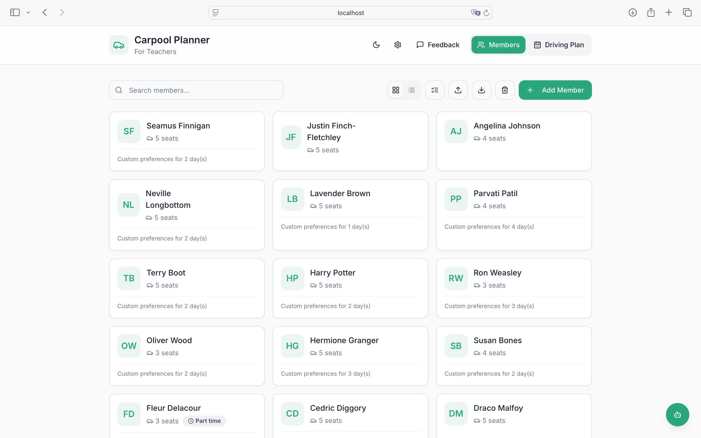

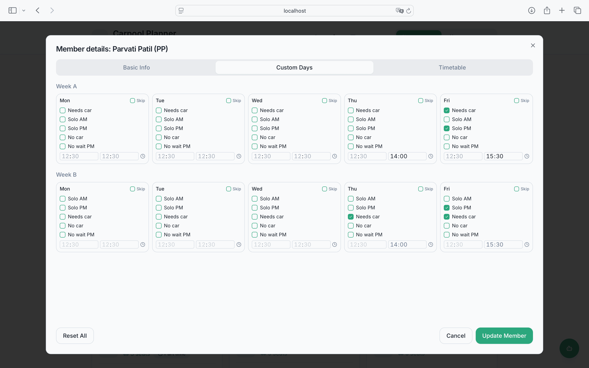


> **Initials matter.** A member's initials must exactly match their teacher
> shorthand on your school's WebUntis server — the app uses them to look up
> that person's timetable. Wrong or mismatched initials mean an empty or
> wrong schedule for that member.

### 2. Authenticating with WebUntis
Connect with your school's WebUntis account so the app can pull everone's real lesson times automatically, instead of anyone having to enter a timetable by hand.

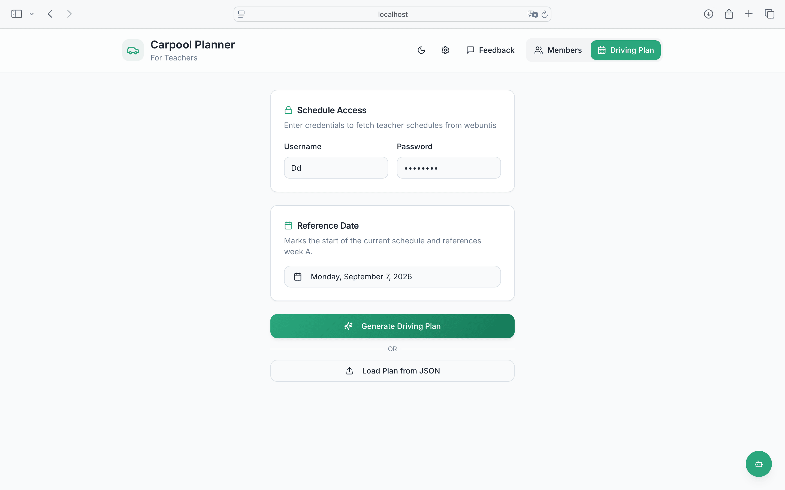

### 3. Generating a driving plan
With members and timetables in place, hit generate and let the CP-SAT solver crunch every combination of parties, seats, and schedules into a mathematically optimal, fairly-distributed driving plan in seconds.

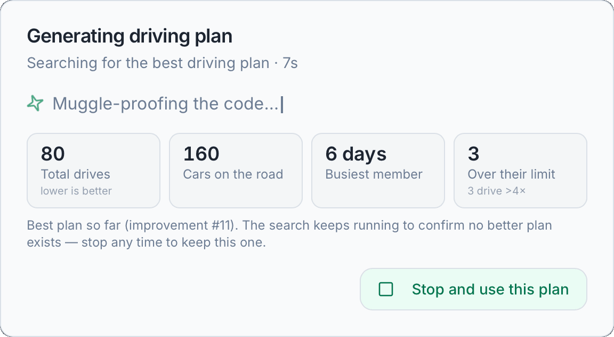
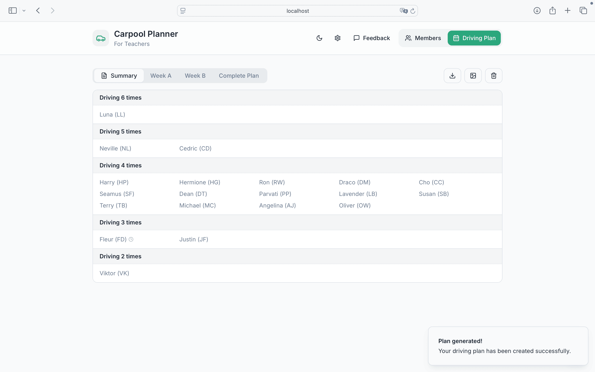
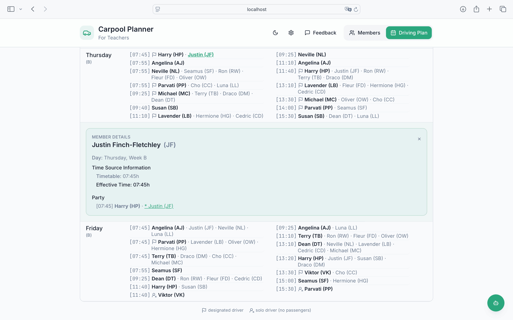

### 4. Tweaking a plan
Not every constraint fits neatly into the solver — so plans stay editable afterwards. Manually swap two passengers between matching parties directly in the grid, or describe a convenience tweak in plain English (e.g. "Put Cho and Harry into the same party where possible") and let the assistant find and apply it, highlighting exactly which slots it changed.

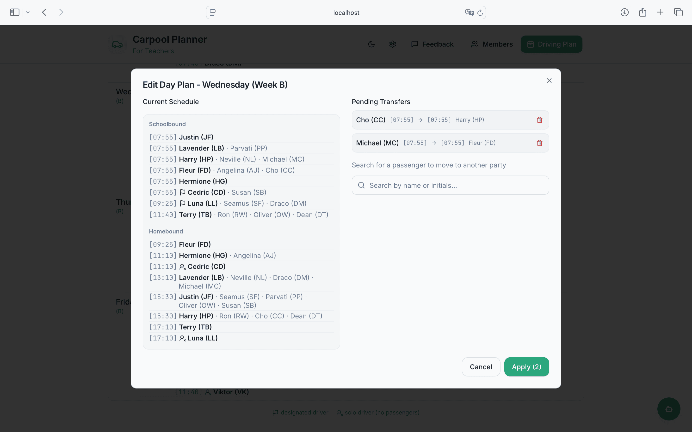
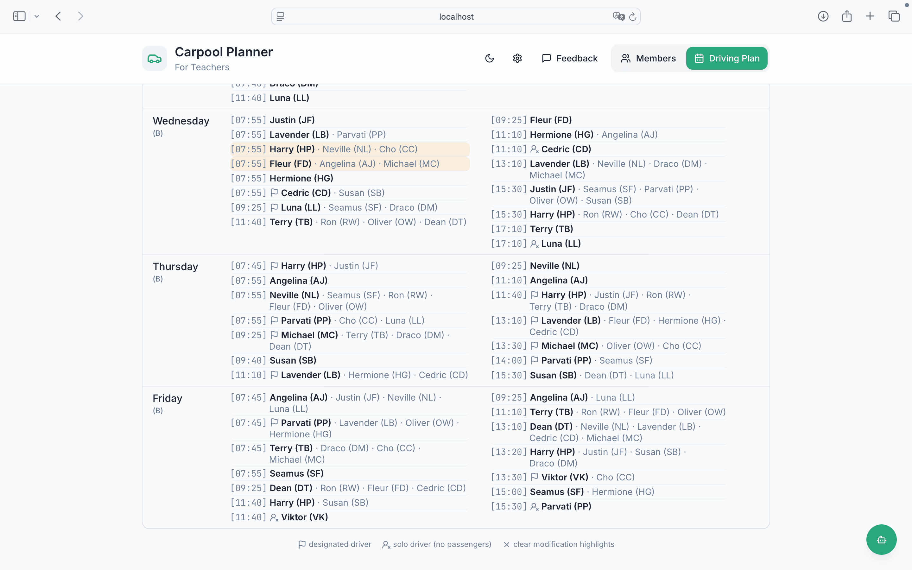


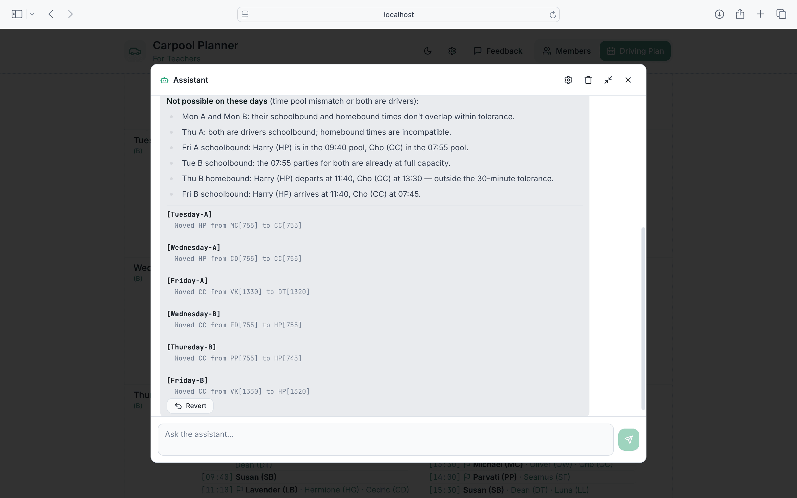

### 5. Generating PNGs to distribute the plan
Once the plan is final, export it as ready-to-share PNG images — no spreadsheet wrangling needed to hand it to the whole group.

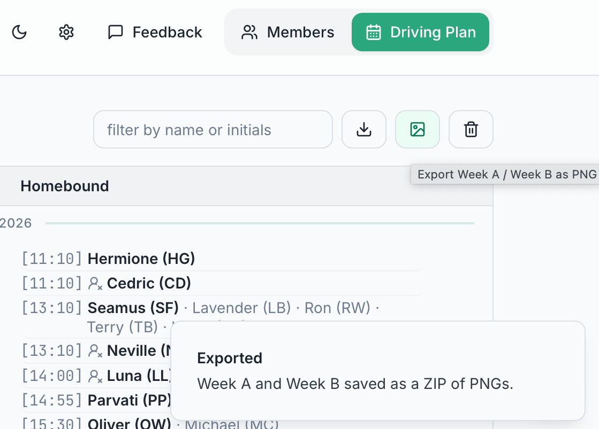

### 6. Configuration options
Tune the WebUntis connection and the solver's planning behavior to match how your school and carpool actually work.


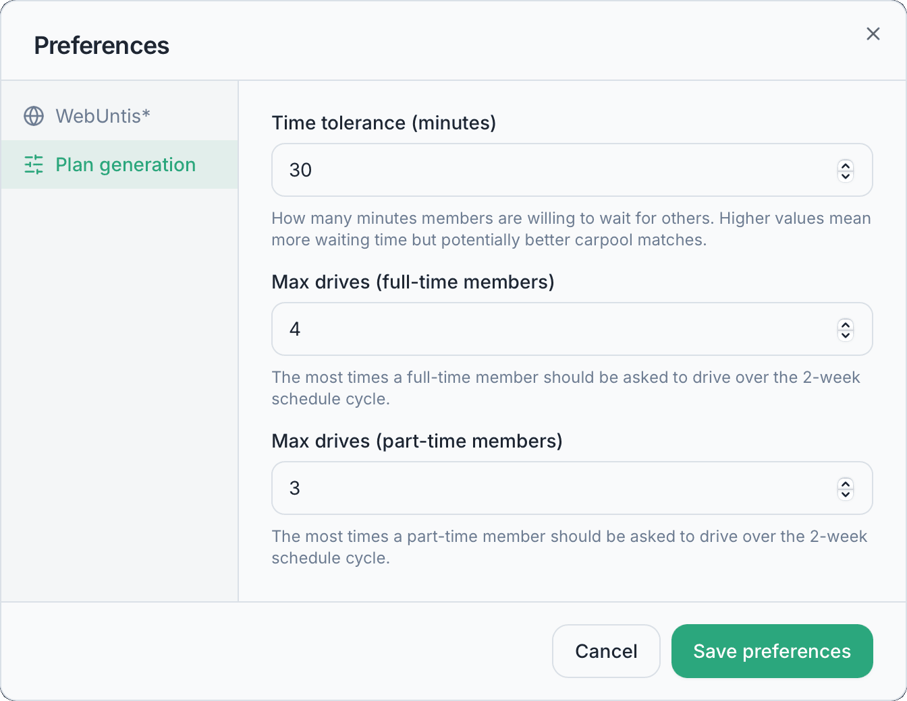

Required WebUntis settings here are your school's WebUntis server URL and
school name, plus the login credentials from step 2 — without these the app
can't fetch real timetables and falls back to placeholder schedules.

### 7. Feedback
Spotted a bug or have an idea? The built-in feedback form files it straight to GitHub as an issue, no separate tracker to dig up.

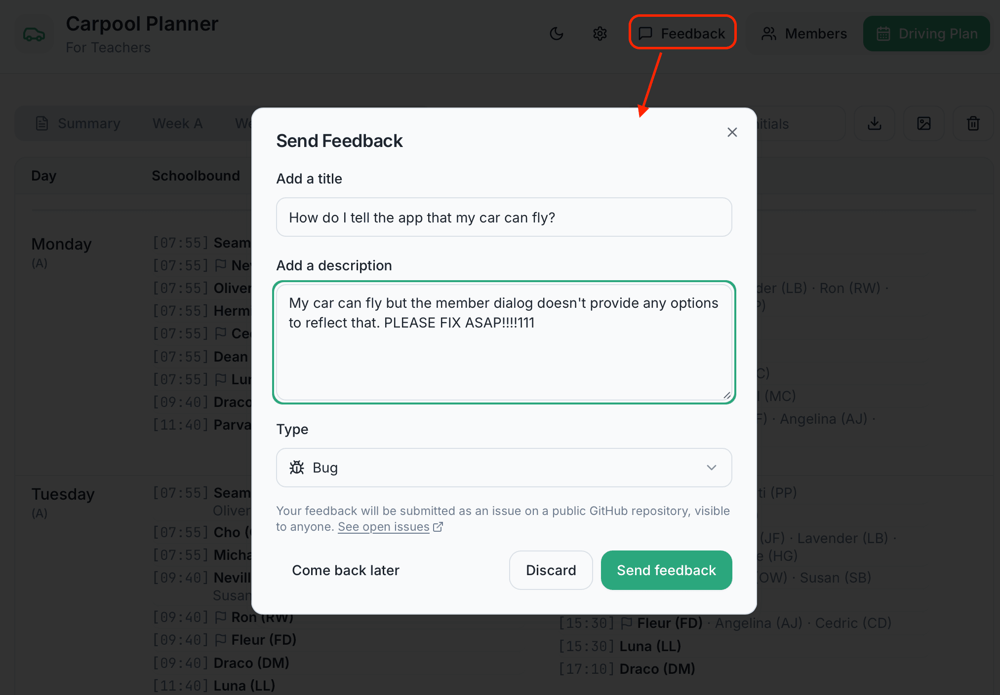

## Contributing

Contributions are welcome — bug reports and feature ideas via the in-app
feedback form or [GitHub issues](https://github.com/thabok/mycartime/issues),
and PRs against `main`.

### Repository layout

```
.
├── src/
│   ├── backend/     Flask REST API + scheduling algorithm (Python)
│   ├── frontend/    React/Vite UI (git submodule → mycartime-frontend)
│   └── src-tauri/   Tauri desktop shell (Rust) that ships the app to end users
├── scripts/         Local/CI build and dev-run scripts
└── doc/             Design notes and setup docs
```

- **src/frontend/** is a git submodule pointing at
  [thabok/mycartime-frontend](https://github.com/thabok/mycartime-frontend). It is a
  separate repository with its own history; commits made inside `src/frontend/`
  must be committed and pushed from within that directory, and the
  superproject then records the new commit hash via `git add src/frontend`.
- WebUntis access is implemented directly in `src/backend/src/webuntis_client.py`,
  a small hand-written JSON-RPC client — there is no third-party WebUntis
  dependency to install.

### Prerequisites

- Python 3.9+
- Node.js + npm
- Git (with submodule support)

### Getting the code

```bash
git clone --recurse-submodules https://github.com/thabok/mycartime.git
# or, if already cloned without submodules:
git submodule update --init --recursive
```

### Running in dev mode

```bash
./scripts/run.sh
```

This will, on first run:
1. Create a Python virtualenv in `.venv` and install `src/backend/requirements.txt`.
2. Run `npm install` in `src/frontend/` if `node_modules` is missing.

Then it starts both services concurrently:
- Backend on `http://localhost:1338` (Flask)
- Frontend on `http://localhost:8080` (Vite dev server, with hot module reload)

Press `Ctrl+C` to stop both. The frontend supports hot-reloading — edits
there take effect immediately. **The backend does not auto-reload**; after
changing backend code, stop and re-run `./scripts/run.sh` (or just re-run it,
it skips the already-installed dependencies).

### Building the desktop app

End users get a native app rather than the two dev servers above: a Tauri
shell loads the built frontend and runs the Flask backend as a sidecar
process, compiled to a standalone executable with Nuitka.

Additionally required: Rust (via [rustup](https://rustup.rs)) and `nuitka`
(`pip install nuitka`) in the backend venv.

```bash
./src/backend/build_sidecar.sh   # compile the backend (once per OS, minutes)
npm --prefix src install         # Tauri CLI
npm --prefix src run build       # produces the installer
```

Installers land in `src/src-tauri/target/release/bundle/` — `.dmg`/`.app` on
macOS, `.msi`/`.exe` on Windows (only the `.exe`/nsis installer is published
in releases; `.msi` is built but withheld to avoid confusing users with two
Windows installers). Nuitka does not cross-compile, so each platform builds
its own.

Three scripts wrap these steps:

- `scripts/build.sh` — local build on macOS.
- `scripts/build.ps1` — local build on Windows.
- `.github/workflows/release.yml` — builds both installers via GitHub
  Actions and publishes them as release artifacts when a `v*` tag is
  pushed.

The packaged backend keeps its cache, logs and settings in the OS
per-user data directory (the shell passes it as `APP_DATA_DIR`), not next
to the code, and binds an OS-assigned loopback port so it cannot collide
with a development backend.

### Backend

- Entry point: `src/backend/src/app.py` (run as a plain script from
  `src/backend/src/`, since its modules use flat imports).
- Config (WebUntis server, solver tuning, port): `src/backend/src/config.py`.
- Plan engine: `src/backend/src/solver_service.py` (an OR-Tools CP-SAT model —
  see `doc/ALGORITHM_EVOLUTION.md` for how this replaced an earlier greedy
  heuristic).
- WebUntis connector: `src/backend/src/timetable_service.py`.

#### API

- `GET /api/v1/check` — health check.
- `POST /api/v1/drivingplan` — calculate a driving plan. See
  `doc/SETUP.md` for a worked example of the request/response shape.

#### Backend tests

```bash
source .venv/bin/activate
cd src/backend
python -m pytest test/
```

`test/test_integration.py` expects the backend to already be running on
port 1338.

### Frontend

Standard Vite + React app in `src/frontend/`. See that submodule's
own contents for component structure. In dev mode it talks to the backend
at `http://<current-host>:1338`; in the packaged app it instead asks the
Tauri shell for the sidecar's actual (OS-assigned) port via IPC — see
`src/frontend/src/lib/config.ts`.

### More docs

See `doc/` for deeper design notes (`SETUP.md`, `TESTING.md`,
`backend_implementation.md`, etc.). See `AGENTS.md` for guidance aimed at AI
coding agents working in this repo.
