# My Cartime - Teacher's Ride Share

The ultimate way to calculates optimal school-run carpool driving plans for a group of teachers,
based on their WebUntis timetables and per-member preferences/constraints. Powered by [Google’s CP-SAT Solver](https://developers.google.com/optimization/cp/cp_solver?hl=en), it treats your chaotic school schedules as a constraint satisfaction problem, crunching millions of permutations to deliver mathematically optimal routes in seconds.

## Brief walkthrough

### 1. Managing members
Add every teacher once, with their seat capacity and any day-specific quirks (part-time schedules, custom pickup/drop-off preferences), then drill into a member to review their WebUntis-derived timetable. This member roster is the single source of truth the solver plans against.

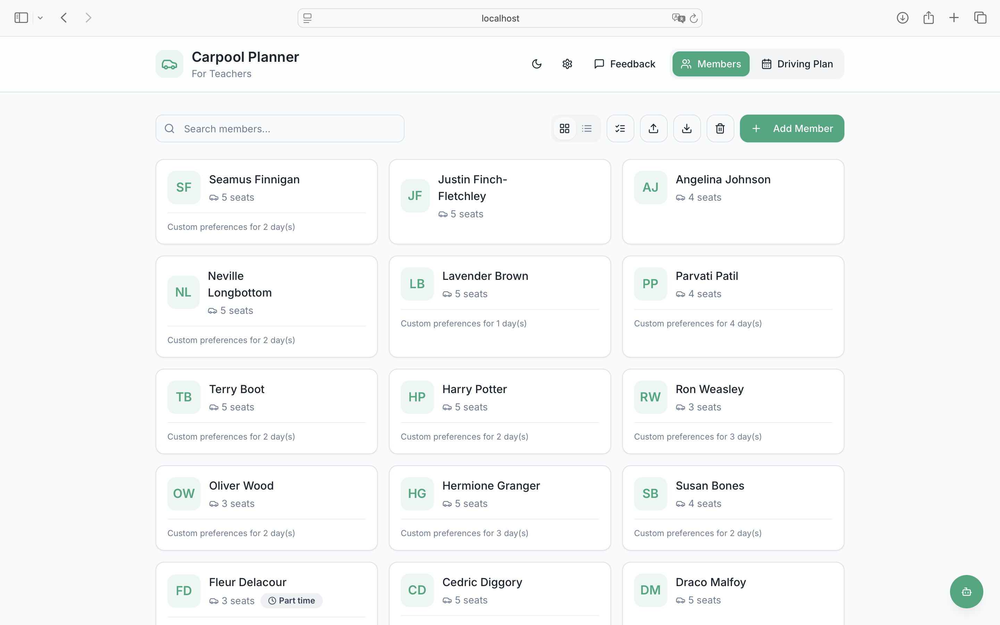
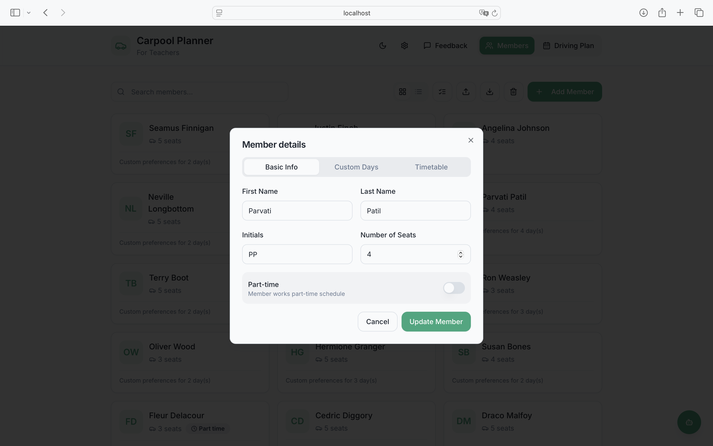
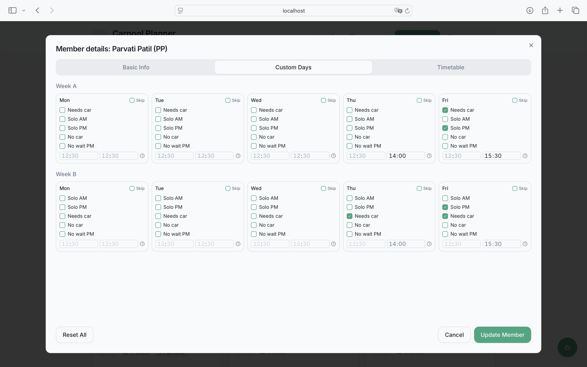
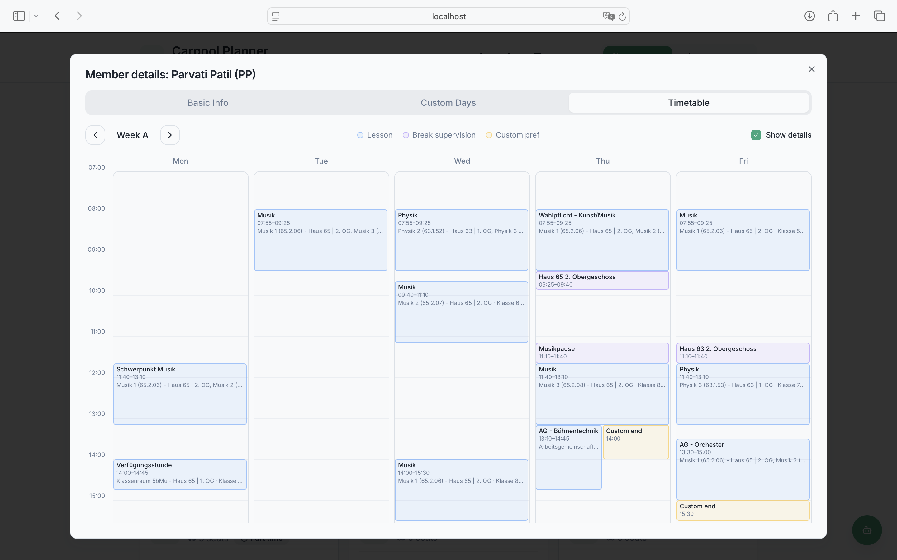

### 2. Authenticating with WebUntis
Connect with your school's WebUntis account so the app can pull everone's real lesson times automatically, instead of anyone having to enter a timetable by hand.


### 3. Generating a driving plan
With members and timetables in place, hit generate and let the CP-SAT solver crunch every combination of parties, seats, and schedules into a mathematically optimal, fairly-distributed driving plan in seconds.

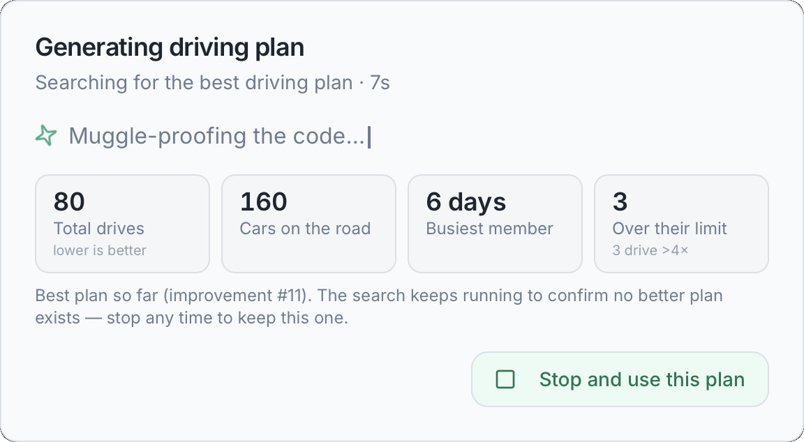
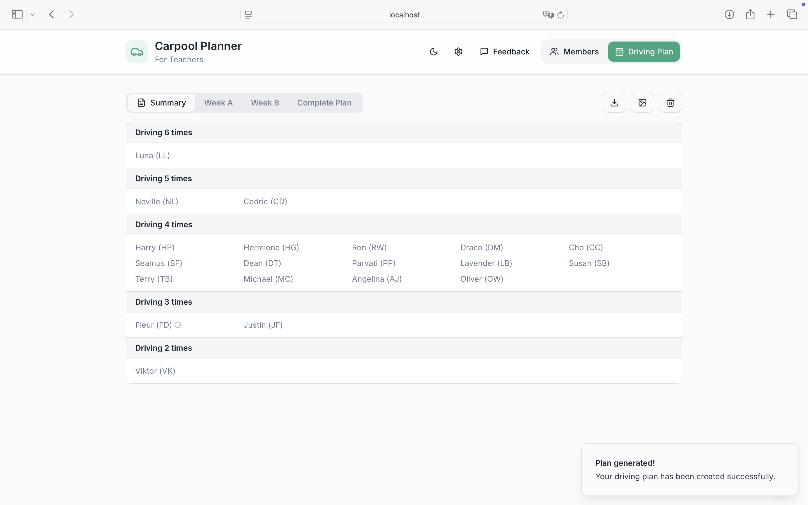
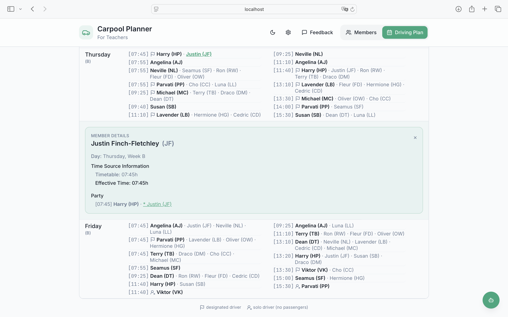

### 4. Tweaking a plan
Not every constraint fits neatly into the solver — so plans stay editable afterwards. Manually swap two passengers between matching parties directly in the grid, or describe a convenience tweak in plain English (e.g. "Put Cho and Harry into the same party where possible") and let the assistant find and apply it, highlighting exactly which slots it changed.

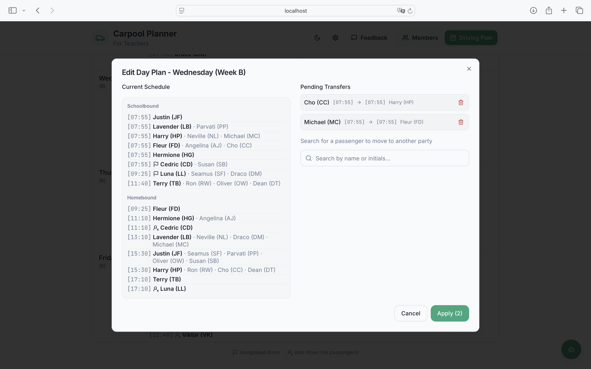

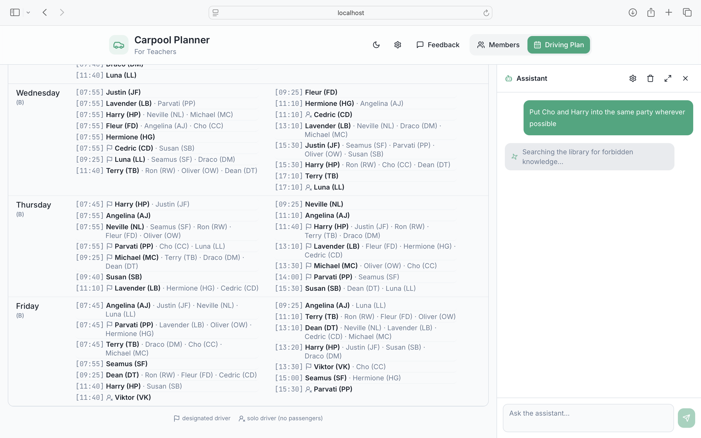
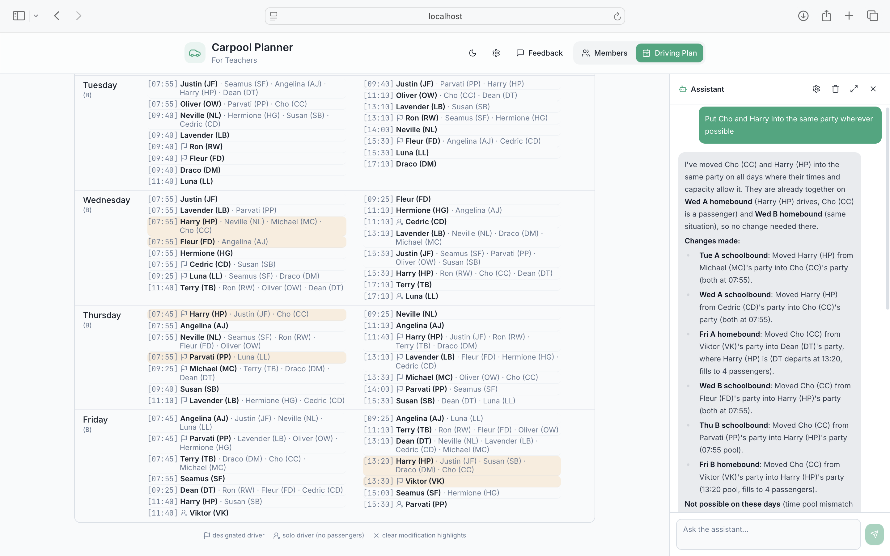
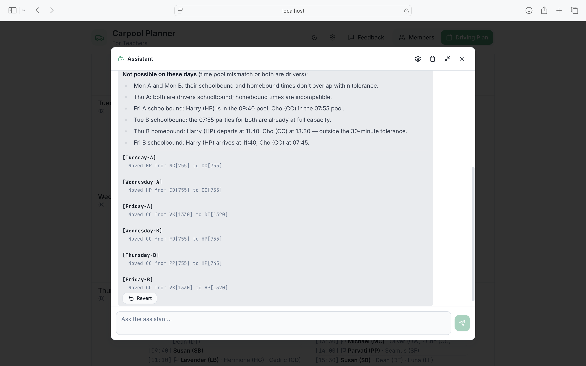

### 5. Generating PNGs to distribute the plan
Once the plan is final, export it as ready-to-share PNG images — no spreadsheet wrangling needed to hand it to the whole group.

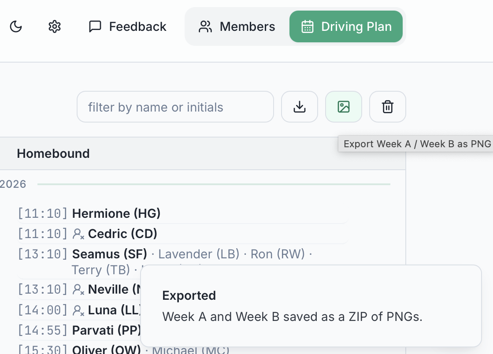

### 6. Configuration options
Tune the WebUntis connection and the solver's planning behavior to match how your school and carpool actually work.

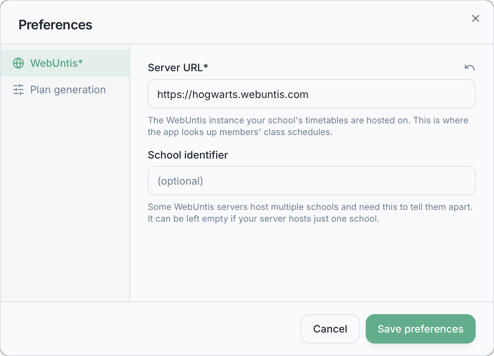


### 7. Feedback
Spotted a bug or have an idea? The built-in feedback form files it straight to GitHub as an issue, no separate tracker to dig up.


## Repository layout

```
.
├── backend/     Flask REST API + scheduling algorithm (Python)
├── frontend/    React/Vite UI (git submodule → mycartime-frontend)
├── webuntis/    Forked WebUntis API client (git submodule → python-webuntis)
├── schemas/     JSON schemas for the driving-plan API contracts
├── doc/         Design notes and setup docs
└── run.sh       Runs backend + frontend together for local development
```

- **frontend/** is a git submodule pointing at
  [thabok/mycartime-frontend](https://github.com/thabok/mycartime-frontend). It is a
  separate repository with its own history; commits made inside `frontend/`
  must be committed and pushed from within that directory, and the
  superproject then records the new commit hash via `git add frontend`.
- **webuntis/** is a git submodule pointing at
  [thabok/python-webuntis](https://github.com/thabok/python-webuntis), a
  fork of the original
  [python-webuntis](https://github.com/python-webuntis/python-webuntis)
  client. The backend installs it in editable mode from this path instead
  of pulling `webuntis` from PyPI, because the fork contains changes
  required for this backend's connection approach to work.

## Prerequisites

- Python 3.9+
- Node.js + npm
- Git (with submodule support)

## Getting the code

```bash
git clone --recurse-submodules https://github.com/thabok/mycartime.git
# or, if already cloned without submodules:
git submodule update --init --recursive
```

## Running the app

```bash
./run.sh
```

This will, on first run:
1. Create a Python virtualenv in `backend/venv` and install `backend/requirements.txt`.
2. Install the local `webuntis` fork into that venv in editable mode.
3. Run `npm install` in `frontend/` if `node_modules` is missing.

Then it starts both services concurrently:
- Backend on `http://localhost:1338` (Flask)
- Frontend on `http://localhost:8080` (Vite dev server, with hot module reload)

Press `Ctrl+C` to stop both. The frontend supports hot-reloading — edits
there take effect immediately. **The backend does not auto-reload**; after
changing backend code, stop and re-run `./run.sh` (or just re-run it, it
skips the already-installed dependencies).

## Backend

- Entry point: `backend/src/app.py` (run as a plain script from `backend/src/`,
  since its modules use flat imports).
- Config (WebUntis server, solver tuning, port): `backend/src/config.py`.
- Plan engine: `backend/src/solver_service.py` (an OR-Tools CP-SAT model —
  see `doc/ALGORITHM_EVOLUTION.md` for how this replaced an earlier greedy
  heuristic).
- WebUntis connector: `backend/src/timetable_service.py`.

### API

- `GET /api/v1/check` — health check.
- `POST /api/v1/drivingplan` — calculate a driving plan. See
  `schemas/driving_plan_request.json` / `schemas/driving_plan.json` for the
  request/response shape, and `doc/SETUP.md` for a worked example.

### Backend tests

```bash
source backend/venv/bin/activate
cd backend
python -m pytest test/
```

`test/test_integration.py` expects the backend to already be running on
port 1338.

## Frontend

Standard Vite + React + shadcn/ui app in `frontend/`. See that submodule's
own contents for component structure. It talks to the backend at
`http://<current-host>:1338`.

## More docs

See `doc/` for deeper design notes (`SETUP.md`, `TESTING.md`,
`backend_implementation.md`, etc.). See `AGENTS.md` for guidance aimed at AI
coding agents working in this repo.
